# Spring 2019

  
  <b> CSE-573: Computer Vision & Image Processing </b>

### [Edge Detection](Project_01/Edge_Detection) :
  

**Problem:** 
Detect edges of a grayscale image.

**Approach:**
- The project applies `Sobel` and `Prewitt` filters to detect edges in a given image
- Implements common image processing tasks : 
  - padding
  - convolution
  - correlation
  - normalization etc.
  
**Sample input and output:** 

Input image:  

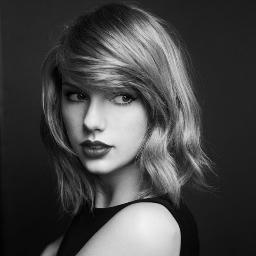

Output image:  

Edge detection using `Prewitt` filter: 

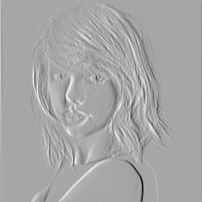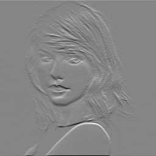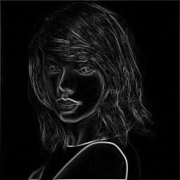

Edge detection using `Sobel` filter: 

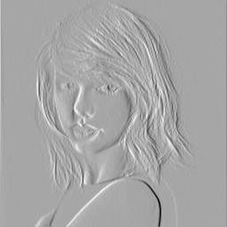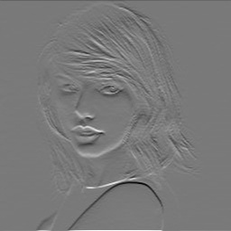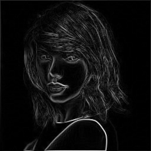

### [Template Matching](Project_01/Template_Matching) :
  

**Problem:** 
`Character Detection`: Find a specific character in a given image using template matching algorithms.

**Approach:**
- The project applies **Template matching algorithm** to detect a specific character (ex. a/b/c) in a given image
- Implements `NCC (Normalized Cross Correlation)` for matching the template with the given image

**Sample input and output:** 

Input image:  

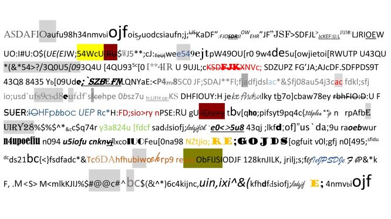

**Templates:**
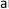
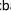
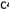

Output image:  
**detecting a**

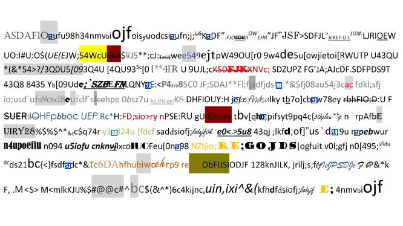

**detecting b**

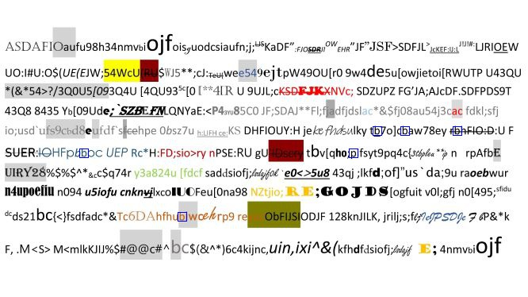

### [Panorama/Image Stitching](Project_02) :
  

**Problem:** 
`Image Stitching`: Create a panoramic image from at most 3 images. Overlap of the given images will be at least 20% and not more than 50%. Any API provided by OpenCV could be used, except “`cv2.findHomography()`” and APIs that have “stitch”, “Stitch”, “match” or “Match” in their names, e.g., “cv2.BFMatcher()” and “cv2.Stitcher.create()”.

**Approach:**
- Keypoints detection and 128 bit feature vector computation using `SIFT`
- Homography matrix generation using `SVD`
- Implements `RANSAC` algorithm for finding the best Homography matrix
- Stitch all images

[Project Report](Project_02/Report.pdf)

**Sample input and output:** 

Input image:  

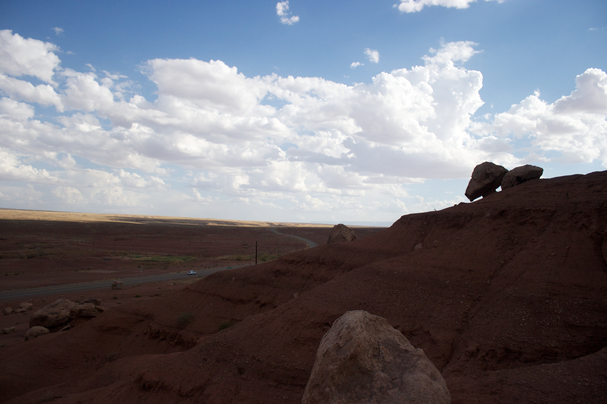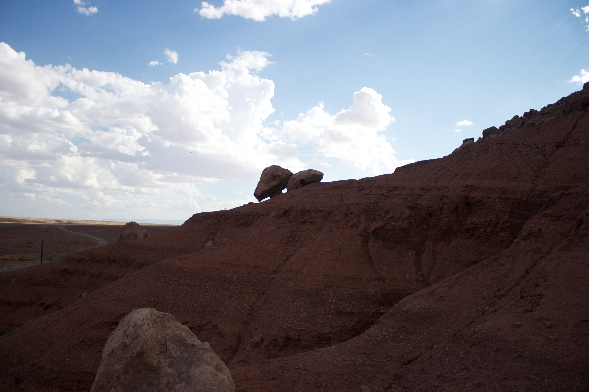

Output image:  
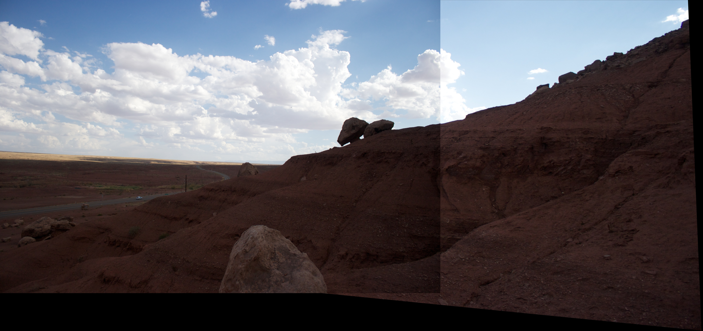

---
## License

- **[MIT license](http://opensource.org/licenses/mit-license.php)**

[Back To The Top](#spring-2019)
